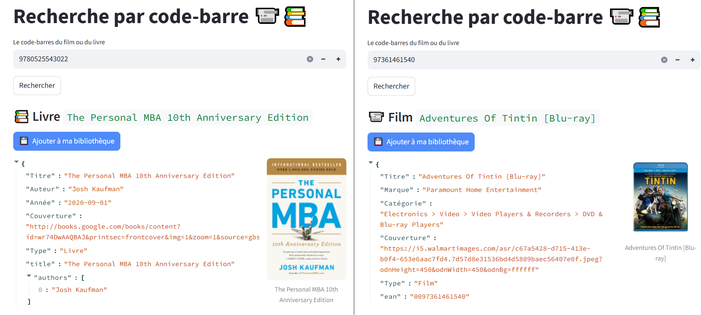

# Ma bibliothèque Streamlit 📚

Voici une app Streamlit afin d'inventorier le contenu de sa bibliothèque (Livres, BD, DVD, CD ...)

On saisie/scanne le code barre de l'arrière de nos produits (EAN-13 principalement), l'app streamlit retourne les metadonnées liées.
On pourra alors choisir d'ajouter l'objet à notre bibliothèque (à venir)

Si c'est un **livre** (code débutant par 978/979/977), on s'appuie sur l'api books de Google (1000 appels par jour). **Sinon**, on utilise l'api de [UPCitemdb](https://www.upcitemdb.com/api/explorer#!/lookup/get_trial_lookup) (50 appels par jour)

**Note:** Etaient pressentis pour rapprocher un code-bare à son film les [datasets IMDb](https://developer.imdb.com/non-commercial-datasets/) ou l'api [omdbapi.com](https://www.omdbapi.com). Malheureusement, ceux-ci ne comportent pas les codes EAN-13 empêchant tout rapprochement.

## Inspirations & ressources

- by [Gaël Penessot](https://github.com/gpenessot)
  - [Streamlit App Template](https://github.com/gpenessot/streamlit-app-template)
- by Snowflake
  - [Streamlit Getting Started demo](https://docs.snowflake.com/en/developer-guide/streamlit/getting-started#build-your-first-sis-app)
- by Streamlit
  - [Create a multi-app page](https://docs.streamlit.io/get-started/tutorials/create-a-multipage-app)
  - [Snowflake connexion](https://docs.streamlit.io/develop/tutorials/databases/snowflake#write-your-streamlit-app)
- from the Streamlit Community (inventory apps)
  - [Inventory Management System](https://sumaiyaansarihere-inventory-management-system-app-ovsbbn.streamlit.app) by [github/sumaiyaansarihere](https://github.com/sumaiyaansarihere/Inventory-Management-System)
  - [Fresh Grocery Inventory](https://your-repository-name-5p5a7eh584xfpqjrqizvvh.streamlit.app/) by [github/Abdul84-stack](https://github.com/Abdul84-stack/grocery-inventory-app)